# C-AIR: Airline Reservation System

A web-based airline reservation system built with Flask and Oracle DB.

## Stack

| | |
|---|---|
| Backend | Python, Flask |
| Frontend | HTML / CSS / JavaScript (Jinja2) |
| Database | Oracle DB (`oracledb`) |
| Email | Gmail SMTP |

## Project Structure

```
├── app.py              # Flask entry point & routing
├── db_utils.py         # DB logic (queries, reservation, cancellation, email)
├── sql/
│   ├── DDL.sql         # Schema definition
│   └── data.sql        # Sample data
├── templates/          # login, flight_search, flight_check, admin
├── static/
│   ├── css/            # Per-page stylesheets
│   └── js/script.js
├── .env                # SMTP credentials (gitignored)
└── Makefile
```

## Setup

```bash
source venv/bin/activate
make          # or: python app.py
```

Set SMTP credentials in `.env`:
```
SMTP_USER=your_gmail@gmail.com
SMTP_PASS=your_app_password
```

DB connection is configured in `db_utils.py → get_connection()` (`user="TP"`, `dsn="localhost:1521/XE"`).

## Database Schema

| Table | Description |
|-------|-------------|
| `AIRPLANE` | Flight info (airline, flight no., departure/arrival time & airport) |
| `SEATS` | Seat class, price, and remaining count per flight |
| `CUSTOMER` | Customer info (name, email, password, passport no.) |
| `RESERVE` | Reservation records (flight, customer, seat class, payment) |
| `CANCEL` | Cancellation records (flight, customer, refund amount, timestamp) |

- Composite primary keys on all tables (e.g. flight no. + departure datetime)
- `RESERVE` and `CANCEL` are kept as separate tables to preserve full history
- UUID-based `reserveId` supports repeated reserve → cancel cycles on the same flight

## Features

### Login

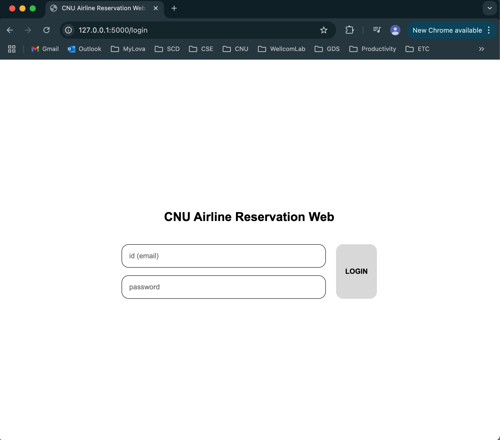

Email + password authentication. Accounts with customer ID starting with `C0` are routed to the admin page (`admin@admin.com` / `admin`).

---

### Flight Search & Reservation

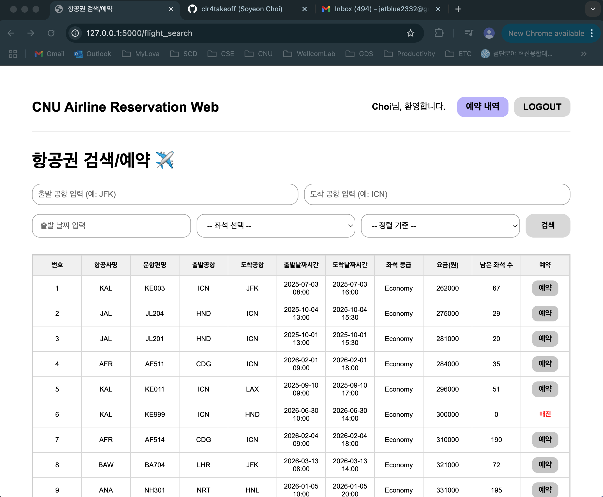

Filter by departure airport, arrival airport, date, seat class, and sort order. Only shows flights departing after the current time. Sold-out flights are marked 매진.

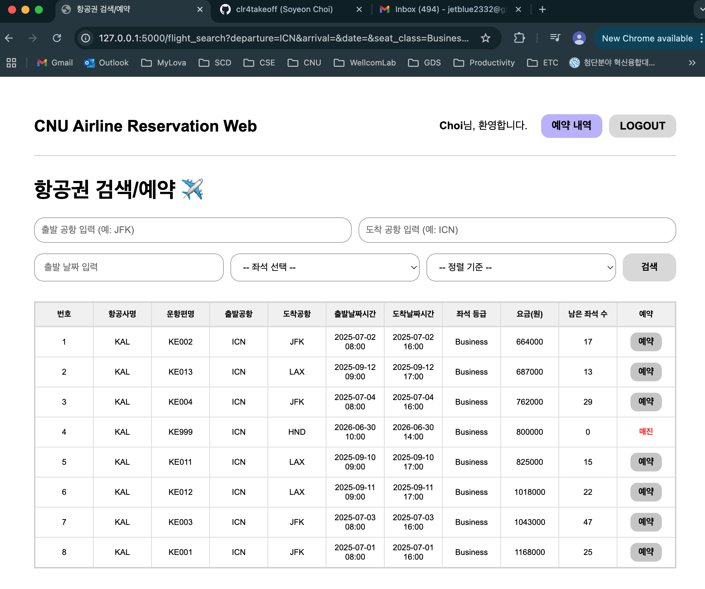

Booking requires a confirmation popup. On success, a confirmation email is sent via Gmail SMTP and the user is redirected to their reservation list.

| Confirm | Complete |
|---|---|
| 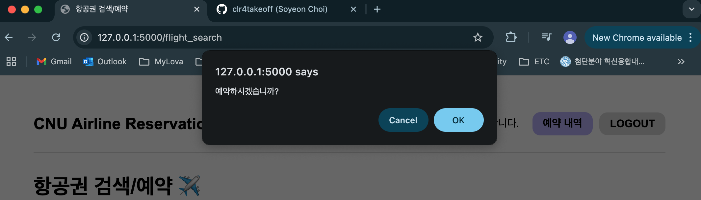 | 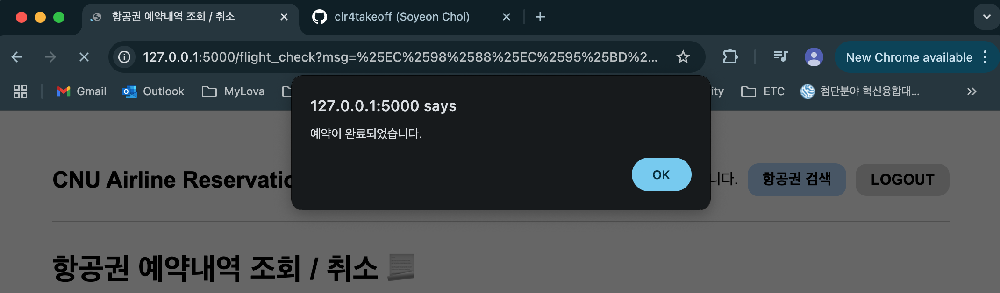 |

---

### Reservation History

| Reservations | All History |
|---|---|
| 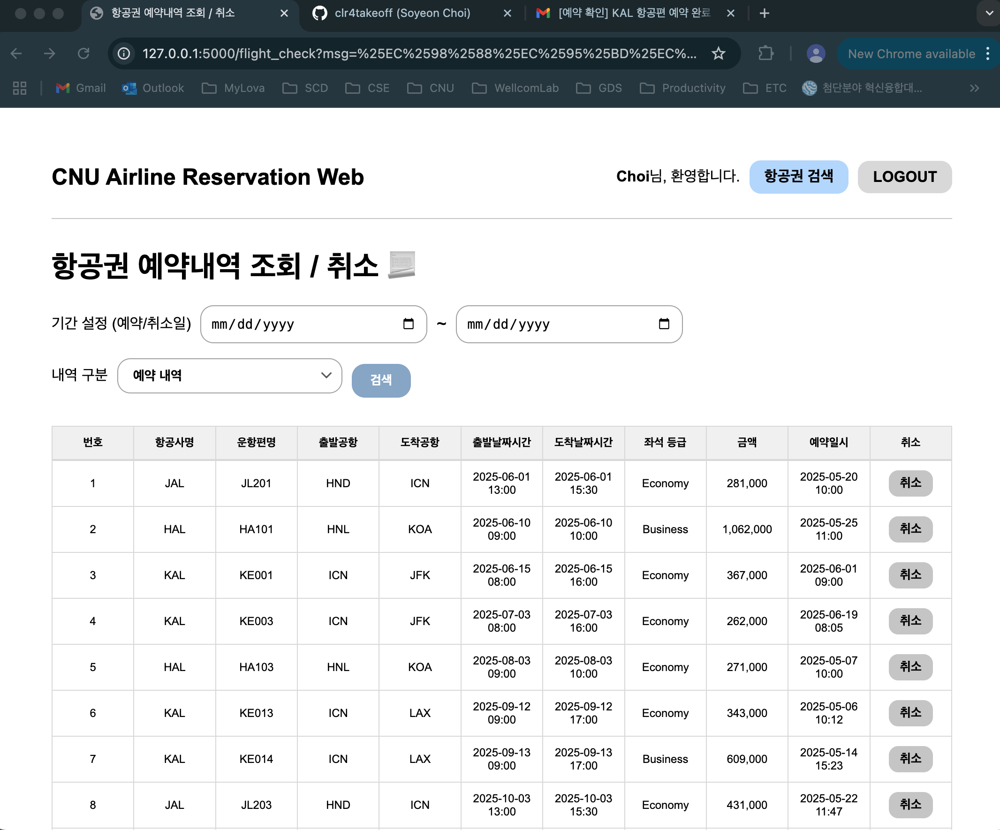 | 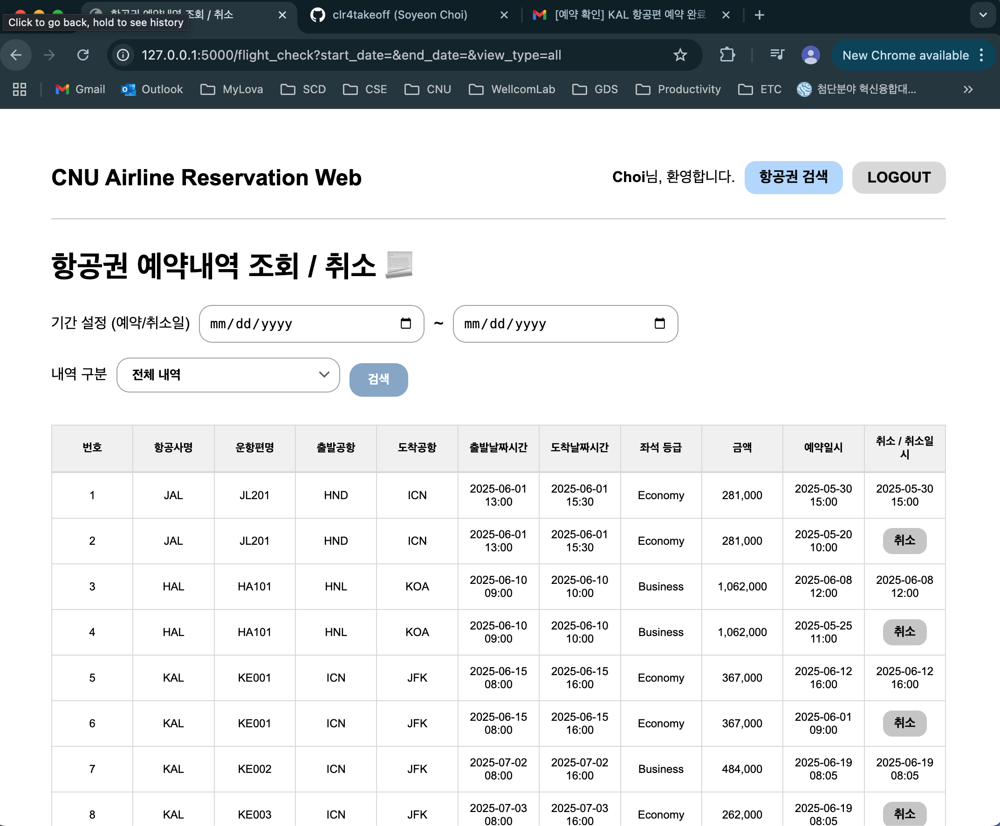 |

Toggle between reservation-only, cancellation-only, and all history. Supports date range filtering (start only, end only, or both). Active reservations show a Cancel button; cancelled ones show the cancellation datetime.

---

### Cancellation

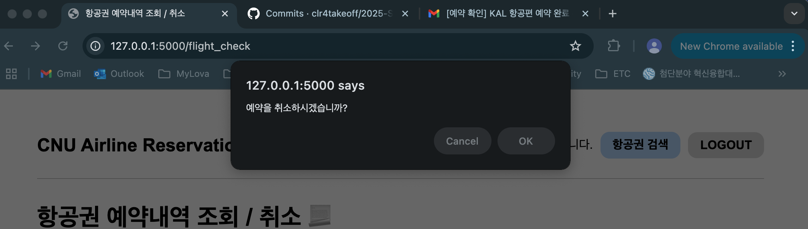

Cancellation fees are calculated automatically based on days remaining until departure.

| Days Before Departure | Fee |
|---|---|
| 15+ days | ₩150,000 |
| 4–14 days | ₩180,000 |
| 1–3 days | ₩250,000 |
| Same day | Full price |
| Already departed | Not allowed |

| 15+ days | 4–14 days | 1–3 days | Same day |
|---|---|---|---|
| 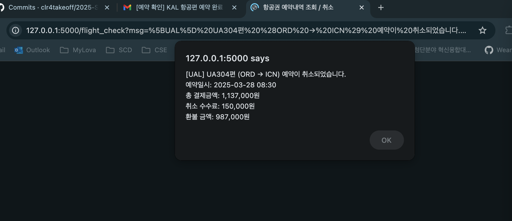 | 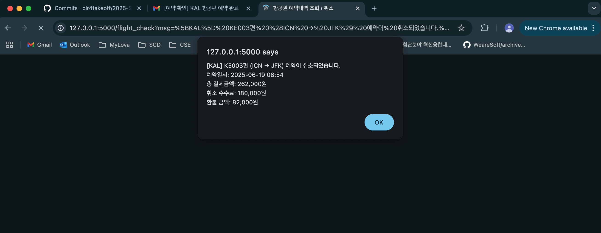 | 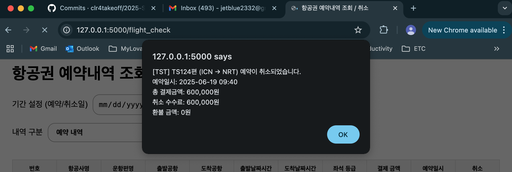 | 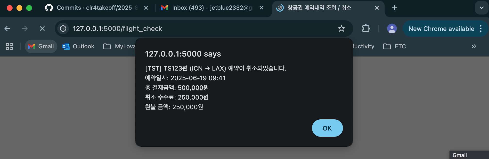 |

---

### Admin Statistics

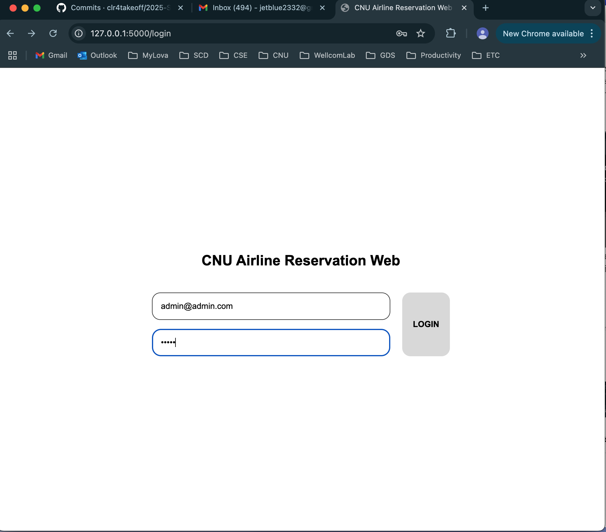

**(1) Cancellation Rate**

| Per customer | With overall total |
|---|---|
| 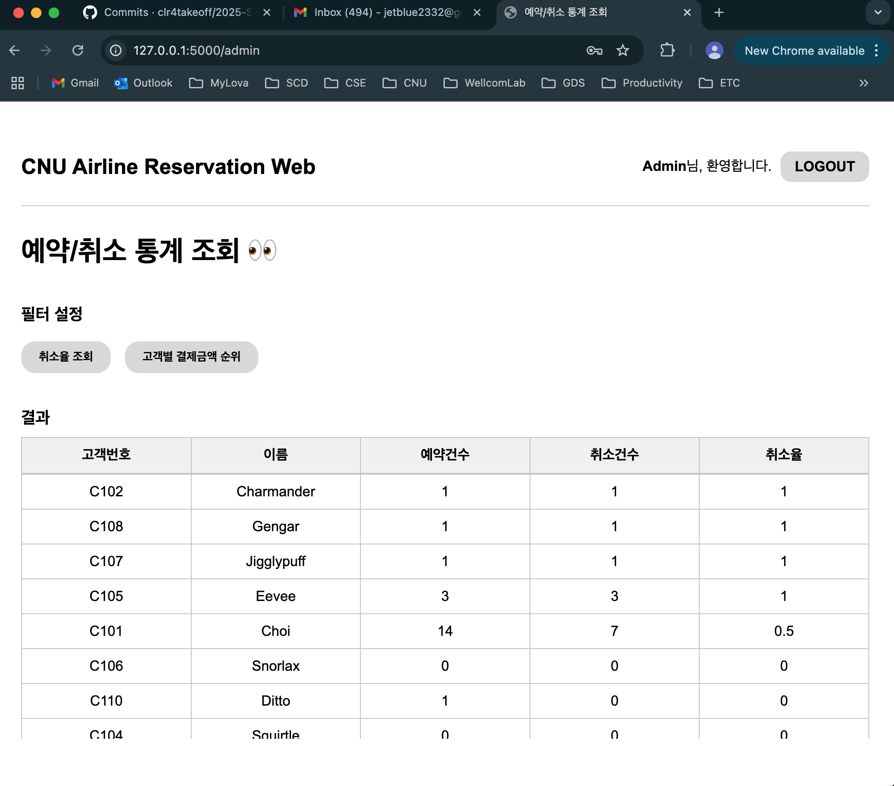 | 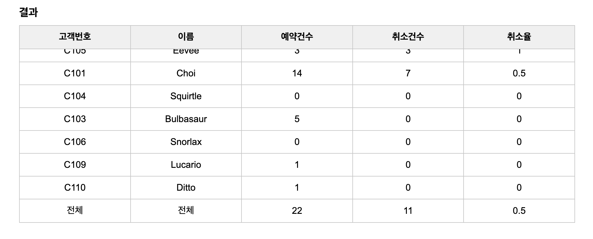 |

Shows each customer's reservation count, cancellation count, and cancellation rate — sorted by rate descending. The last row shows the aggregate rate across all customers.

**(2) Payment Ranking**

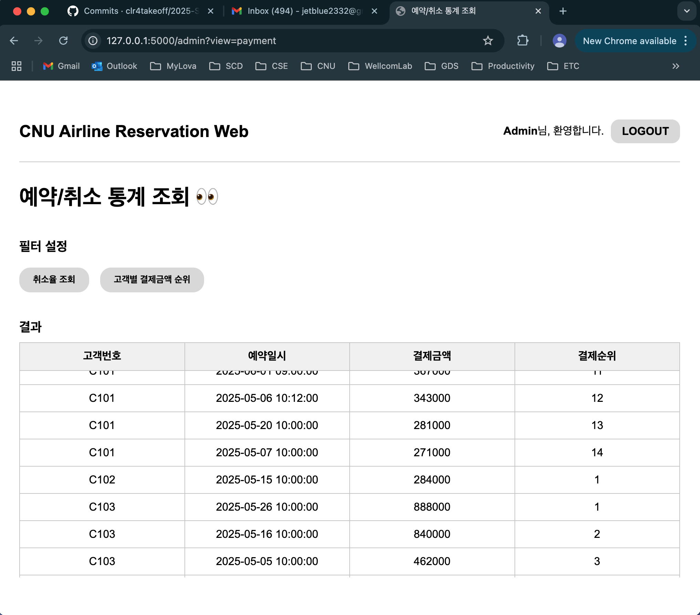

Ranks each customer's individual payments using `RANK()` window function, grouped per customer. Useful for comparing spending patterns.
